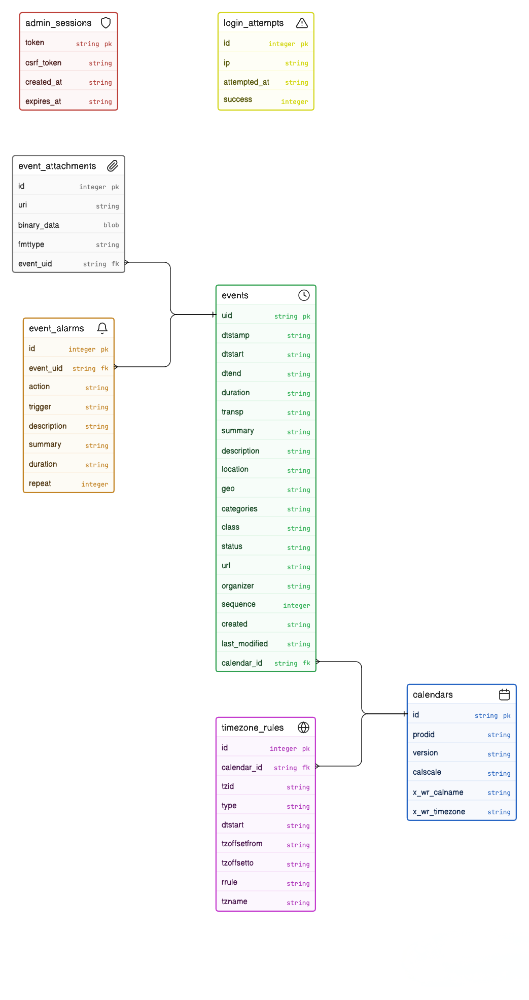

# NTUAS Calendar System

A Cloudflare Worker-based system that serves an ICS calendar subscription and a public-facing calendar website. It utilizes a Cloudflare D1 database to store and manage calendar events, allowing users to subscribe to dynamic events seamlessly across calendar clients (like Apple Calendar, Google Calendar, Outlook). It also includes a public landing page and a built-in GUI admin dashboard for creating, editing, and managing events.

## Features

- **Public Calendar Page:** A beautiful, responsive web calendar served at the root (`/`) for users to view upcoming events.
- **ICS Subscription Endpoint:** Serves a standard RFC 5545 `.ics` feed directly from the D1 database, with correct UTF-8 line folding (75-octet limit) for full compatibility with CJK characters.
- **Admin Dashboard:** A responsive web interface at `/admin` for creating, editing, and deleting calendar events, protected by a secure cookie-based session login with CSRF protection and login rate limiting.
- **Event Support:** Comprehensive support for both Timed and All-Day events.
- **JSON Endpoint:** Fetch all active events via a JSON endpoint (`/api/events`).
- **Cloudflare D1:** Uses a serverless SQLite database for low-latency, globally distributed database queries.

## Database Schema



## Prerequisites

- [Node.js](https://nodejs.org/) installed
- A [Cloudflare](https://cloudflare.com/) account
- Cloudflare [Wrangler CLI](https://developers.cloudflare.com/workers/wrangler/install-and-update/)

## Setup & Local Development

1. **Install dependencies:**
   ```bash
   npm install
   ```

2. **Log in to Cloudflare:**
   ```bash
   npx wrangler login
   ```

3. **Create the D1 Database:**
   ```bash
   npx wrangler d1 create calendar_db
   ```
   *Take note of the `database_name` and `database_id` returned in the output and update your `wrangler.jsonc` file with these values under the `d1_databases` section.*

4. **Initialize Database Schema:**
   Apply the provided schema (`schema.sql`) to your local and/or production databases. The schema includes all tables and indexes.

   > ⚠️ `schema.sql` starts with `DROP TABLE IF EXISTS` statements — **do not run it against a production database that already has data**. To add indexes only to an existing database, run the `CREATE INDEX` statements individually with `--remote`.

   ```bash
   # For local development (safe — creates a fresh local SQLite)
   npx wrangler d1 execute calendar_db --local --file=./schema.sql

   # For production (only for initial setup, not for existing databases with data)
   npx wrangler d1 execute calendar_db --remote --file=./schema.sql
   ```

   Then seed the required calendar record and optional sample events:
   ```bash
   # For local development
   npx wrangler d1 execute calendar_db --local --file=./seed.sql

   # For production (seed.sql inserts one calendar row + a sample event)
   npx wrangler d1 execute calendar_db --remote --file=./seed.sql
   ```

   *The seed inserts a calendar record with ID `main-cal-001`, which the worker expects. If you prefer to insert it manually:*
   ```bash
   npx wrangler d1 execute calendar_db --local --command="INSERT INTO calendars (id, x_wr_calname, x_wr_timezone) VALUES ('main-cal-001', 'NTUAS Events', 'Asia/Singapore');"
   ```

   **Alternative: clone production data to local** (instead of using seed.sql):
   ```bash
   # Export remote database (self-contained — includes CREATE TABLE statements)
   npx wrangler d1 export calendar_db --remote --output=./remote_backup.sql

   # Wipe local state (required — the export has its own CREATE TABLE statements)
   rm -rf .wrangler/state/v3/d1

   # Import directly — do NOT run schema.sql first
   npx wrangler d1 execute calendar_db --local --file=./remote_backup.sql
   ```

5. **Set the Admin Password:**
   You must set the `ADMIN_PASSWORD` securely via Wrangler secrets. This is required for both local development and production.
   ```bash
   npx wrangler secret put ADMIN_PASSWORD
   ```

6. **Start the local server:**
   ```bash
   npm run dev
   ```
   The application will be available at `http://localhost:8787` (or whatever port Wrangler assigns).

## Testing

Tests run inside a real Cloudflare Workers runtime (via `@cloudflare/vitest-pool-workers`) with an in-memory D1 database — no remote database or secrets required.

```bash
npm test
```

The test suite covers:
- `GET /api/events` — response format, headers (Content-Type, Cache-Control, CORS)
- `POST /admin/login` — correct/wrong password, rate limiting (429 after 5 failures), secure cookie attributes
- `GET /admin` — unauthenticated redirect, authenticated dashboard, security headers
- `POST /admin` — CSRF validation, input validation (add & update), event CRUD operations
- `POST /admin/logout` — CSRF-protected POST logout, session cookie cleared
- `GET /subscribe` — RFC 5545 compliance, line folding (75-octet limit), VALARM, all-day `VALUE=DATE`, CORS/cache/security headers
- Unknown routes — 404 with security headers

## Deployment

Deploy the worker to the Cloudflare network:

```bash
npm run deploy
```

## Usage & Endpoints

- **`GET /`**: The public-facing HTML calendar page showing valid events.
- **`GET /subscribe` or `GET /calendar.ics`**: The main ICS feed URL. Add this URL to Apple Calendar, Google Calendar, or other clients to subscribe to the events.
- **`GET /admin`**: The admin dashboard UI to manage events. Requires the admin session login using the environment secret password.
- **`POST /admin`**: API to programmatically insert, update, or delete an event (requires authentication).
- **`GET /api/events`**: Returns a JSON array of all current calendar events in the database.

## User Guide

### 1. Admin Dashboard Usage
The Admin Dashboard located at `/admin` is your control center for managing the calendar.
- **Logging In**: Access the dashboard and log in using the `ADMIN_PASSWORD` defined in your environment secrets.
- **Creating & Editing Events**: Fill out the event details such as title, location, category, and time. 
- **Timed vs. All-Day Events**: 
  - *Timed Events*: Specify an exact start and end time (e.g., a meeting from 2:00 PM to 3:00 PM).
  - *All-Day Events*: Toggle "All Day Event" to span the entire day without specific hours. If an end date is not provided, it defaults to a single day.
- **Deleting Events**: Existing events listed on the dashboard can be deleted by entering your admin password in the deletion prompt.

### 2. Calendar Subscription
Users can subscribe to the calendar so that events sync directly to their personal devices.
1. Navigate to the public calendar page (`/`).
2. Click the **"Copy Subscription URL"** button or manually copy the `/subscribe` link.
3. Add the copied URL to your preferred calendar application:
   - **Apple Calendar**: Go to *File > New Calendar Subscription...* and paste the URL.
   - **Google Calendar**: On the left panel under "Other calendars," click the `+` icon > *From URL* and paste the link.
   - **Outlook**: Go to *Add Calendar > Subscribe from web* and paste the URL.

### 3. Public View
The root page (`/`) serves as a public-facing, responsive web calendar for your users.
- **Interactive Calendar Widget**: Users can view the current month, shift through previous or upcoming months using the navigation arrows, and click on highlighted dates to view specific event details.
- **Upcoming Events**: A quick-glance list of the closest upcoming events is prominently displayed alongside the calendar for easy access.

### 4. Important Notes
- **ICS Sync Latency**: Please note that third-party calendar applications check for updates at their own internal intervals. While Apple Calendar allows you to set the refresh frequency (e.g., every 5 minutes), **Google Calendar may take up to 12-24 hours to reflect new updates or changes**. This latency is controlled by Google and cannot be forced from the application.

## Commands Reference

<!-- AUTO-GENERATED from package.json scripts -->
| Command | Description |
|---------|-------------|
| `npm run dev` | Start local development server at `http://localhost:8787` |
| `npm run start` | Alias for `npm run dev` |
| `npm run deploy` | Build and deploy the Worker to Cloudflare |
| `npm test` | Run the test suite (Vitest with Cloudflare Workers runtime) |
| `npm run cf-typegen` | Generate TypeScript types from `wrangler.jsonc` bindings |
<!-- END AUTO-GENERATED -->

## Security

- **Authentication**: Session-based with HttpOnly, Secure, SameSite=Strict cookies. Sessions expire after 24 hours.
- **CSRF Protection**: Per-session CSRF tokens validated on all admin POST requests. Token stored in `<meta name="csrf-token">`.
- **Rate Limiting**: Login endpoint blocks IPs after 5 failed attempts within 10 minutes (HTTP 429).
- **Password Comparison**: Uses `crypto.subtle.timingSafeEqual` to prevent timing attacks.
- **Logout**: POST-based with CSRF token — not vulnerable to logout CSRF via `` tags.
- **SQL Injection**: All queries use D1 parameterized bindings — no string concatenation in SQL.
- **Input Validation**: All admin form fields validated on both add and update actions.
- **Content Security Policy**: Enforced on all HTML responses.
- **Secrets**: `ADMIN_PASSWORD` must be set via `wrangler secret put` — never hardcode it.
