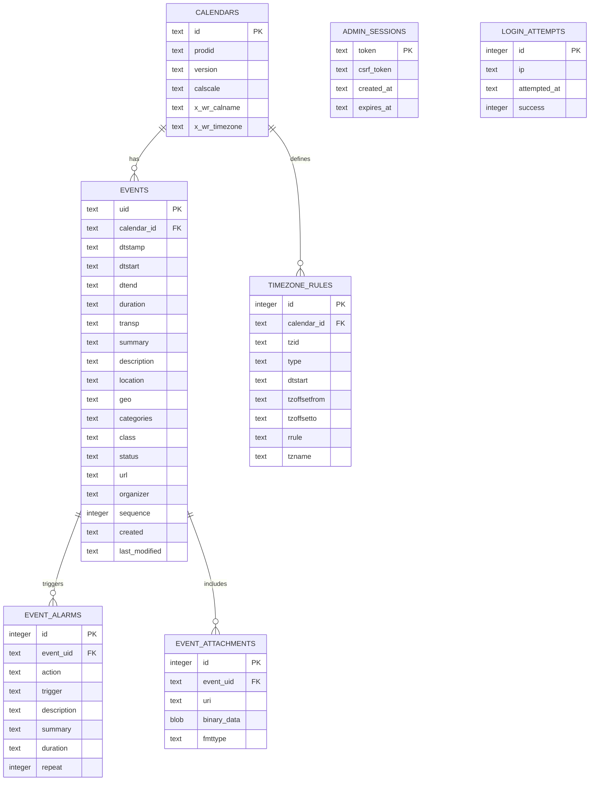

# Entity Relationship (ER) Diagram

This document describes the database entities and relationships defined in `schema.sql`.

## Mermaid ERD



## Relationship Summary

- `calendars (1) -> (many) events` via `events.calendar_id -> calendars.id`
- `calendars (1) -> (many) timezone_rules` via `timezone_rules.calendar_id -> calendars.id`
- `events (1) -> (many) event_alarms` via `event_alarms.event_uid -> events.uid`
- `events (1) -> (many) event_attachments` via `event_attachments.event_uid -> events.uid`

## Notes

- Foreign-key relations use `ON DELETE CASCADE`, so deleting a calendar removes dependent events/timezone rules, and deleting an event removes its alarms/attachments.
- `admin_sessions` and `login_attempts` are operational security tables and are intentionally independent from calendar content entities.

## Alternative Diagram Source (DBML-Style)

```text
notation crows-foot
title iCalendar System Data Model

// Calendar domain
calendars [icon: calendar, color: blue] {
  id string pk
  prodid string
  version string
  calscale string
  x_wr_calname string
  x_wr_timezone string
}

events [icon: clock, color: green] {
  uid string pk
  calendar_id string fk
  dtstamp string
  dtstart string
  dtend string
  duration string
  transp string
  summary string
  description string
  location string
  geo string
  categories string
  class string
  status string
  url string
  organizer string
  sequence integer
  created string
  last_modified string
}

event_attachments [icon: paperclip, color: gray] {
  id integer pk
  event_uid string fk
  uri string
  binary_data blob
  fmttype string
}

event_alarms [icon: bell, color: orange] {
  id integer pk
  event_uid string fk
  action string
  trigger string
  description string
  summary string
  duration string
  repeat integer
}

timezone_rules [icon: globe, color: purple] {
  id integer pk
  calendar_id string fk
  tzid string
  type string
  dtstart string
  tzoffsetfrom string
  tzoffsetto string
  rrule string
  tzname string
}

// Admin domain
admin_sessions [icon: shield, color: red] {
  token string pk
  csrf_token string
  created_at string
  expires_at string
}

login_attempts [icon: alert-triangle, color: yellow] {
  id integer pk
  ip string
  attempted_at string
  success integer
}

// Relationships
events.calendar_id > calendars.id
event_attachments.event_uid > events.uid
event_alarms.event_uid > events.uid
timezone_rules.calendar_id > calendars.id
```